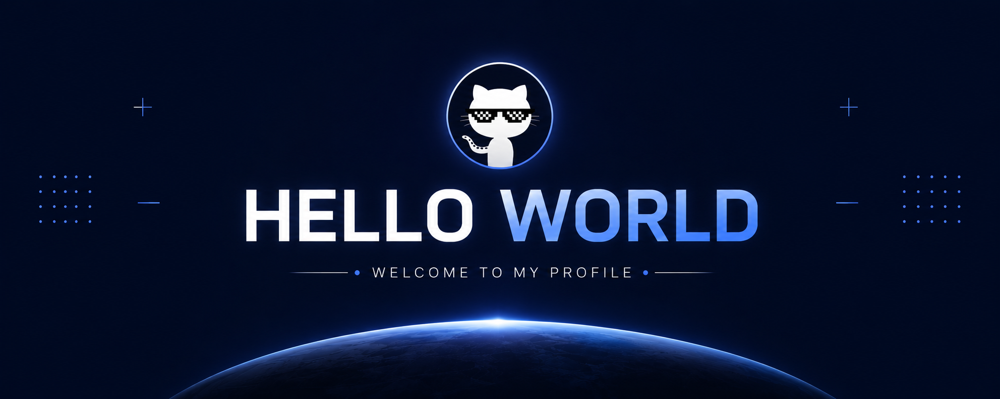
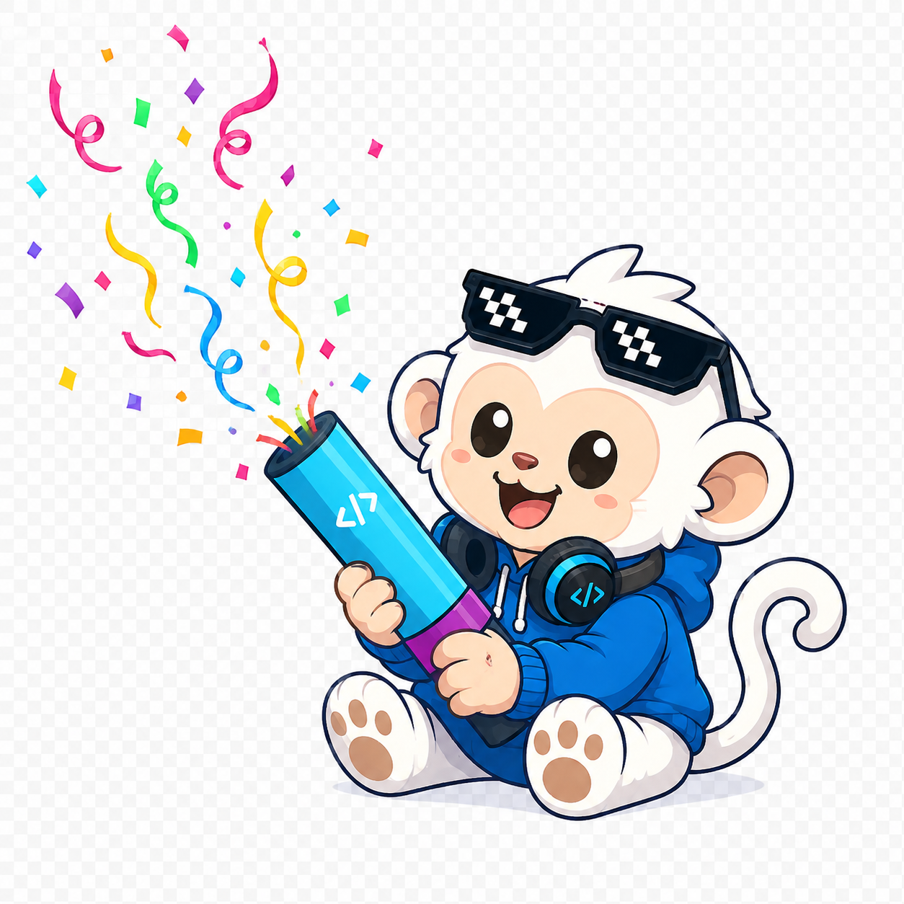

<!--Banner-->

<!--Mascot image-->

  

<!--Header Name-->
# ɪ'ᴍ ʜᴜʏ! 
*Full Stack Developer*
  

<!--Start Intro-->               

Mình là một Full Stack Developer với niềm đam mê C++, C#, JavaScript, React, .NET và xây dựng ứng dụng từ đầu đến cuối.

- ✨ Học hỏi mỗi ngày là một cơ hội
- 🌱 Đang tìm hiểu sâu hơn về React.js, Next.js và backend .NET
- 💻 Xem thêm các dự án của mình ngay bên dưới
- 📫 Liên hệ mình qua Facebook hoặc Email
<!--End Intro-->

<!--Profile Count Badge-->

  

---

<!--Tech Stack Section-->       
<h2 align="center">Tᴇᴄʜ Sᴛᴀᴄᴋ</h2> 

<h3 align="left">Current Learning</h3>
<ul align="left">
  <li>Đào sâu React.js patterns và state management.</li>
  <li>Cải thiện kỹ năng backend với .NET và Node.js.</li>
  <li>Tìm hiểu thêm về database design với Postgres và MongoDB.</li>
</ul>
 

<!--Trophies Section-->   
<h2 align="center">🏆 Gɪᴛʜᴜʙ Tʀᴏᴘʜɪᴇs 🏆</h2>

  

 

<!--Github stats Table--> 
<h2 align="center">📊 Gɪᴛʜᴜʙ Sᴛᴀᴛs 📊</h2>

<table width="100%">
  <tr>
    <td width="50%">
      <h3 align="center"><strong>Gɪᴛʜᴜʙ Sᴛᴀᴛs</strong></h3>
      

        
      

    </td>
    <td width="50%">
      <h3 align="center"><strong>Sᴛʀᴇᴀᴋ Sᴛᴀᴛs</strong></h3>
      

        
      

    </td>
  </tr>
</table>

<h3 align="center">Tᴏᴘ Lᴀɴɢᴜᴀɢᴇs</h3>

 

<!--Contribution Graph-->
<h2 align="center">📈 Cᴏɴᴛʀɪʙᴜᴛɪᴏɴ Gʀᴀᴘʜ 📈</h2>

    

---

<!--Dynamic Quote card--> 
<h2 align="center">🌟 Tʜᴏᴜɢʜᴛ ᴏғ ᴛʜᴇ Dᴀʏ 🌟</h2>

    

---

<!--Contact Section--> 
<h2 align="center">🤝 Kᴇ̂́ᴛ ɴᴏ̂́ɪ ᴠᴏ̛́ɪ Mɪ̀ɴʜ 🤝</h2>

 

<!--Footer--> 

  

